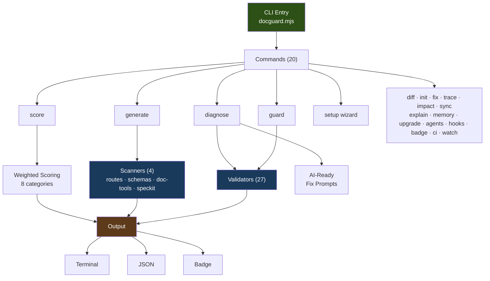

# 🛡️ DocGuard

**English** · [Português (BR)](README.pt-BR.md) · [Español](README.es.md)

> **The enforcement layer for Spec-Driven Development.**
> Validate. Score. Enforce. Ship documentation that AI agents can actually use.

[](https://github.com/raccioly/docguard/actions/workflows/ci.yml)
[](https://www.npmjs.com/package/docguard-cli)
[](https://www.npmjs.com/package/docguard-cli)
[](https://pypi.org/project/docguard-cli/)
[](https://opensource.org/licenses/MIT)
[](https://nodejs.org)
[-green)](package.json)
[](https://github.com/github/spec-kit)
[](https://glama.ai/mcp/servers/raccioly/docguard)
[](https://registry.modelcontextprotocol.io/)

---

> **✨ See what DocGuard catches in 30 seconds — no install, no setup:**
> ```bash
> npx docguard-cli demo
> ```
> Runs against a baked-in sample project with intentional drift and shows you the findings + a clear path to fixing them.


---

## Table of Contents

- [What is DocGuard?](#what-is-docguard)
- [Why DocGuard?](#why-docguard)
- [Quick Start](#-quick-start)
- [Spec Kit Integration](#-spec-kit-integration)
- [Usage](#usage)
- [Validators](#-validators)
- [Templates](#-templates)
- [AI Agent Support](#-ai-agent-support)
- [Slash Commands](#-slash-commands)
- [Examples](#-examples)
- [Testing](#-testing)
- [Enterprise Adoption](#-enterprise-adoption)
- [CI/CD Integration](#%EF%B8%8F-cicd-integration)
- [What's New](#-whats-new)
- [File Structure](#-file-structure)
- [Configuration](#%EF%B8%8F-configuration)
- [Research Credits](#-research-credits)

---

## What is DocGuard?

DocGuard enforces **Canonical-Driven Development (CDD)** — a methodology where documentation is the source of truth, not an afterthought. AI writes the docs, DocGuard validates them.

| Traditional Development | Canonical-Driven Development |
|:----|:----|
| Code first, docs maybe | Docs first, code conforms |
| Docs rot silently | Drift is tracked and enforced |
| Docs are optional | Docs are required and validated |
| One AI agent, one context | Any agent, shared context via canonical docs |

DocGuard is an official [GitHub Spec Kit](https://github.com/github/spec-kit) community extension. It validates the artifacts that Spec Kit creates, ensuring your specs stay high-quality throughout the development lifecycle.

📖 **[Philosophy](PHILOSOPHY.md)** · 📋 **[CDD Standard](STANDARD.md)** · ⚖️ **[Comparisons](COMPARISONS.md)** · 🔬 **[Validation](VALIDATION.md)** · 🗺️ **[Roadmap](ROADMAP.md)**

### Architecture



> **Distribution**: Node.js core (npm) · Python wrapper (PyPI) · GitHub Action (`action.yml`) · Spec Kit Extension (ZIP)

---

## Why DocGuard?

Documentation that drifts from code is worse than no documentation — it
confidently misleads humans and AI agents alike. DocGuard treats your canonical
docs as an enforced contract: deterministic validators diff what the docs claim
against what the code does, on every commit, with no LLM required. The full
thesis (and the research behind it) lives in [PHILOSOPHY.md](PHILOSOPHY.md);
recent feature highlights moved [below](#-whats-new).

The field data backs the enforcement-over-instructions bet: an ETH Zurich
study across 138 repos / 5,694 agent PRs found the most popular style of
agent-instruction file *hurts* agent performance, and practitioners keep
converging on the same lesson — written rules are routinely ignored;
programmatic checks are what agents (and humans) actually respect. That is
exactly the layer DocGuard provides: not another instructions file, but the
validator suite that makes the instructions and docs verifiably true.

---

## ⚡ Quick Start

> **Package naming:** this repo is `raccioly/docguard`; the published package is **`docguard-cli`** on both [npm](https://www.npmjs.com/package/docguard-cli) and [PyPI](https://pypi.org/project/docguard-cli/); the installed command is `docguard`. Same project — the `-cli` suffix is just the registry name. The package runs **no install scripts**, so `npm i -g docguard-cli --ignore-scripts` is equivalent.

### Node.js (npm)

```bash
# No install needed — run directly
npx docguard-cli diagnose

# Or install globally
npm i -g docguard-cli
docguard diagnose
```

### Python (PyPI)

```bash
pip install docguard-cli
docguard diagnose
```

> **Note:** The Python package is a thin wrapper that delegates to `npx`. Node.js 18+ is required on the system.

### More ways to integrate

- **pre-commit** — changed-only guard on every commit:
  ```yaml
  repos:
    - repo: https://github.com/raccioly/docguard
      rev: v0.29.0
      hooks: [{ id: docguard-guard }]   # docguard-guard-full for pre-push
  ```
- **MCP** (Claude, Cursor, any MCP client) — `claude mcp add docguard -- npx -y docguard-cli mcp`; 5 read-only tools (guard, score, explain, verify-claims, diagnose). Registry manifest ships in-repo (`server.json`, Smithery-ready).
- **GitLab CI** — component staged at [`templates/ci/gitlab-component.yml`](templates/ci/gitlab-component.yml) (guard/score/ci job with a SARIF artifact).
- **Homebrew** — `brew install raccioly/tap/docguard` (formula in [`packaging/homebrew/`](packaging/homebrew/)).

### Core Workflow

```bash
# 1. Initialize docs for your project
npx docguard-cli init

# 2. Or reverse-engineer docs from existing code
npx docguard-cli generate

# 3. AI diagnoses issues and generates fix prompts
npx docguard-cli diagnose

# 4. Validate — use as CI gate
npx docguard-cli guard

# 5. Check maturity score
npx docguard-cli score
```

### The AI Loop

```
diagnose  →  AI reads prompts  →  AI fixes docs  →  guard verifies
   ↑                                                       ↓
   └───────────────── issues found? ←──────────────────────┘
```

`diagnose` is the primary command. It runs all validators, maps every failure to an AI-actionable fix prompt, and outputs a remediation plan. Your AI agent runs it, fixes the docs, and runs `guard` to verify.

### Mechanical vs. agent fixes

DocGuard splits drift into two kinds and is explicit about which is which:

| Kind | Example | How it's fixed |
|------|---------|----------------|
| **Mechanical** (deterministic) | An endpoint documented in `API-REFERENCE.md` that the OpenAPI spec confirms is gone | `docguard fix --write` deletes the row + detail block itself — **no AI** |
| **Agent** (needs judgment) | Rewriting an X-Ray prose section as CloudWatch; writing a new endpoint's request/response | Routed to an AI agent via `diagnose` / `fix --doc` prompts |

`docguard fix --write` only touches docs marked `<!-- docguard:generated true -->` (override with `--force`), is idempotent, and prints exactly what changed. It never rewrites prose — that stays with the agent.

### Hands-off loop (set and forget)

```
guard ──▶ fix --write (mechanical, auto) ──▶ guard ──▶ diagnose (agent prompts for the rest)
```

- **CI / pre-commit:** `docguard hooks --type pre-commit --auto-fix` installs a hook that applies mechanical fixes, re-stages the docs, then runs `guard`; anything left is surfaced as agent prompts.
- **Agent-driven:** `docguard diagnose --auto` scaffolds missing docs **and** applies mechanical fixes, then emits prompts for the content rewrites that remain.
- **JSON for automation:** `guard`/`diagnose --format json` include a `mechanicalFixes` array and tag each issue `mechanical` vs `agent`, so an agent can apply or delegate precisely.

---

## 🌱 Spec Kit Integration

DocGuard is a [community extension](https://github.com/github/spec-kit/blob/main/extensions/README.md) for GitHub's **Spec Kit** framework. While Spec Kit focuses on **creating** specifications (via AI slash commands like `/speckit.specify` and `/speckit.plan`), DocGuard focuses on **validating** their quality.

### How They Work Together

```
┌─────────────────┐          ┌──────────────────┐
│    Spec Kit      │          │    DocGuard       │
│                  │          │                   │
│  /speckit.specify│ ──────→  │  docguard guard   │
│  Creates specs   │          │  Validates specs  │
│  (AI-driven)     │          │  (automated)      │
└─────────────────┘          └──────────────────┘
```

| Phase | Tool | What happens |
|:------|:-----|:-------------|
| 1. Initialize | `specify init` | Creates `.specify/` directory and templates |
| 2. Write specs | `/speckit.specify` | AI creates `spec.md` with FR-IDs, user stories |
| 3. **Validate** | **`docguard guard`** | Checks spec quality (mandatory sections, FR/SC IDs) |
| 4. Plan | `/speckit.plan` | AI creates `plan.md` with technical context |
| 5. **Validate** | **`docguard guard`** | Checks plan quality (sections, structure) |
| 6. Tasks | `/speckit.tasks` | AI creates `tasks.md` with phased breakdown |
| 7. **Validate** | **`docguard guard`** | Checks task quality (phases, T-IDs) |
| 8. Implement | `/speckit.implement` | AI writes code |
| 9. **Enforce** | **`docguard guard`** | Final quality gate — CI/CD |

### What DocGuard Validates in Spec Kit Projects

- **spec.md** — Mandatory sections (User Scenarios, Requirements, Success Criteria), FR-xxx IDs, SC-xxx IDs
- **plan.md** — Summary, Technical Context, Project Structure sections
- **tasks.md** — Phased task breakdown (Phase 1, 2, 3+), T-xxx task IDs
- **constitution.md** — Detected at `.specify/memory/constitution.md` or project root
- **Requirement traceability** — FR, SC, NFR, US, AC, UC, SYS, ARCH, MOD, T IDs

### Installing as a Spec Kit Extension

```bash
specify extension add docguard
```

This installs DocGuard's slash commands (`/docguard.init`, `/docguard.guard`, `/docguard.review`, `/docguard.fix`, `/docguard.update`) into your AI agent's command palette.

---

## Usage

DocGuard ships **20 commands** (the "Daily 5" + 15 situational tools, including the zero-install `demo`, the `mcp` server, and the `ci` pipeline gate). Six additional one-shot scaffolders are accessed via `docguard init --with <name>`. Seven v0.19 commands continue to work as deprecation aliases through v0.20.x — see [MIGRATION-v0.20.md](docs-implementation/MIGRATION-v0.20.md).

**The Daily 5** — what you'll reach for 95% of the time:

| Command | What It Does |
|:--------|:-------------|
| `init`  | Bootstrap a project (`--wizard` for interactive · `--with <name>` for scaffolders) |
| `guard` | Validate against canonical docs — 27 validators |
| `diff`  | Show gaps between docs and code (`--since <ref>` for impact mode) |
| `sync`  | Refresh code-truth doc sections — keeps memory always up to date |
| `score` | CDD maturity score (0-100; `--diff` for delta between refs) |

**Tools (situational, but day-to-day useful):**

| Command | Purpose |
|:--------|:--------|
| `demo` | Zero-install showcase — runs guard against a baked-in drifting fixture (`npx docguard-cli demo`) |
| `diagnose` | AI orchestrator — guard → emit fix prompts in one command |
| `fix` | Generate AI fix instructions for specific docs (`--doc <name> --format prompt`) |
| `fix --write` | Apply deterministic fixes (no AI — version bumps, counts, anchors, sections) |
| `fix --history` | Audit log of every mechanical fix applied (from `.docguard/fixed.json`) |
| `generate` | Reverse-engineer docs from existing codebase (`--plan` for AI scan) — includes auto-generated Mermaid ER diagrams from your detected schemas (Prisma/Drizzle/TypeORM/Sequelize/Django/Rails) in DATA-MODEL.md |
| `agent` | One-shot agent task graph — ordered, pre-filled code-truth, per-task verify (`--format json`) |
| `explain <warning\|CODE>` | Paste any warning — or a finding code like `SEC001` — to get the validator's docstring, fix path, and how to suppress |
| `verify --semantic` | Extract documented numbers/limits/enums (retention days, rate limits, GSI/role counts, status enums) as a task list for an agent to check against code — the semantic-drift class regex/AST can't see |
| `verify --instructions` | Audit AGENTS.md/CLAUDE.md themselves for drift: duplicate rules, never-vs-always contradictions, stale file pointers, unknown commands — plus clustered rule pairs as agent judgment tasks |
| `feedback` | Report likely false positives back to DocGuard — local-first record + a 1-click prefilled, redacted GitHub issue (zero typing) |
| `mcp` | MCP server — exposes guard/score/explain/verify/report/diagnose as native tools for Claude, Cursor, and any MCP client. Stdio: `claude mcp add docguard -- npx docguard-cli mcp`. Team-shared HTTP: `docguard mcp --transport http --port 8585` (loopback by default; non-loopback binds require `--api-key`) |
| `report` | Compliance-evidence bundle for audits — guard verdict + CDD score + ALCOA+ attributes + fix history, stamped with git commit and a tamper-evident sha256 integrity hash (`--format json`, `--out <file>`). Evidence, not a gate: always exits 0 |
| `ci` | Pipeline gate: guard + score in one command — never scaffolds or touches source; its only write is its own `.docguard/history.jsonl` (opt out: `--no-history`). `--threshold <n>` fails below a score, `--fail-on-warning` for strict mode, `--format json` for parsers |
| `score --trend` | Score trajectory from recorded `ci` runs — sparkline, delta, and the last 10 runs with commit stamps |
| `memory` | Per-domain accuracy headline (endpoints / entities / env / tech) |
| `memory --diff` | Drill into which specific claims don't match code |
| `memory --pack` | Write `.docguard/context-pack.md` — compact, code-truth-stamped session-start context for AI agents |
| `score --diff` | Drill into which checks pulled each category down |
| `trace` / `trace --reverse <file>` | Requirements traceability — forward AND reverse |
| `trace --features` | Per-feature spec-adherence scores (requirement coverage, task completion, task evidence, artifacts) — worst-first with fix hints |
| `upgrade [--apply] [--pr]` | Check + migrate `.docguard.json` schema; `--pr` opens a PR |
| `watch` | Live mode: re-run guard on file changes |

**`init --with <name>` scaffolders** — picked at init time:

| Scaffolder | What It Generates |
|:-----------|:------------------|
| `agents` | `AGENTS.md`, `CLAUDE.md`, `.cursor/rules/`, `.github/copilot-instructions.md` |
| `hooks` | Git pre-commit / pre-push hooks |
| `ci` | GitHub Actions / pipeline YAML |
| `badge` | Shields.io score badges for README |
| `llms` | `llms.txt` (AI-friendly summary) |
| `publish` | External doc-site config (Mintlify) — experimental |

Run them solo (`docguard init --with hooks`) or stacked (`docguard init --with agents,hooks,badge,ci`).

**Deprecation aliases** — `setup` · `agents` · `hooks` · `ci` · `badge` · `llms` · `publish` · `impact` keep working in v0.20.x with a yellow stderr warning. `audit → guard` is permanent (no warning). See [MIGRATION-v0.20.md](docs-implementation/MIGRATION-v0.20.md).

### CLI Flags

| Flag | Description | Commands |
|:-----|:------------|:---------|
| `--dir <path>` | Project directory (default: `.`) | All |
| `--verbose` | Show detailed output | All |
| `--quiet` / `-q` | Suppress banner — for hooks, CI loops, scripts | All |
| `--format json` | Machine-readable output (clean JSON, no ANSI bleed) | guard, score, diff, trace, diagnose, memory, impact, explain |
| `--format sarif` | SARIF 2.1.0 output — findings as rules/results for GitHub Code Scanning and SARIF dashboards | guard |
| `--format junit` | JUnit XML output — one testcase per validator, for GitLab CI (`artifacts:reports:junit`), Jenkins, Azure DevOps, CircleCI | guard |
| `--update-baseline` | Adopt DocGuard on a legacy repo without a red day one: freeze today's findings into a committed `.docguard.baseline.json`; guard/ci then gate only NEW drift. Suppression is always visible ("N pre-existing finding(s) suppressed"), and `--no-baseline` shows the full picture | guard |
| `--full` | Generate `llms-full.txt` (full doc bodies inlined) instead of the `llms.txt` link index | llms |
| `--pack` | Write `.docguard/context-pack.md` — agent session-start context | memory |
| `--sync` | Regenerate the agent-file family (CLAUDE.md, Copilot, Cursor, …) from AGENTS.md; hash-marked, never touches hand-written files without `--force` | agents |
| `--check` | CI gate for the synced agent-file family — exit 2 when a variant is stale | agents |
| `--force` | Overwrite existing files (creates `.bak` backups) | generate, agents, init |
| `--force-redo` | Bypass ping-pong suppression in `.docguard/fixed.json` | fix --write |
| `--profile <name>` | Starter / standard / enterprise | init |
| `--no-spec-kit` | Skip auto-init of `.specify/` / `.agent/` scaffolding | init |
| `--changed-only [--since <ref>]` | Pre-commit lite mode (5 fast validators on changed files only) | guard |
| `--timings` | Per-validator wall-time profile (slowest first) | guard |
| `--show-failing` | Show warnings/errors even when status is PASS | guard |
| `--pin` | Record running CLI version into `.docguard.json` (reproducibility) | guard |
| `--diff` | Per-category drill-down | score, memory |
| `--check-only` | Exit 1 if behind (for CI) | upgrade |
| `--apply` | Actually run the migration | upgrade |
| `--pr` | Open a PR with the migration | upgrade |
| `--reverse <file>` | Reverse traceability (code → docs) | trace |
| `--no-indirect` | Skip the reverse-import-graph analysis (docs about modules that import a changed file) | impact, diff --since |
| `--prs` | Open-PR doc-conflict analysis — two PRs impacting the same canonical doc = merge-order risk (needs the `gh` CLI) | impact |
| `--transport http` `--port` `--host` `--api-key` `--path` | Serve MCP over Streamable HTTP instead of stdio (team-shared server; loopback-only unless an api-key is set) | mcp |
| `--history` | Show fix audit log | fix |

### Example Output

```
$ npx docguard-cli generate

🔮 DocGuard Generate — my-project
   Scanning codebase to generate canonical documentation...

  Detected Stack:
    language: TypeScript ^5.0
    framework: Next.js ^14.0
    database: PostgreSQL
    orm: Drizzle 0.33
    testing: Vitest
    hosting: AWS Amplify

  ✅ ARCHITECTURE.md (4 components, 6 tech)
  ✅ DATA-MODEL.md (12 entities detected)
  ✅ ENVIRONMENT.md (18 env vars detected)
  ✅ TEST-SPEC.md (45 tests, 8/10 services mapped)
  ✅ SECURITY.md (auth: NextAuth.js)
  ✅ REQUIREMENTS.md (spec-kit aligned)
  ✅ AGENTS.md
  ✅ CHANGELOG.md
  ✅ DRIFT-LOG.md

  Generated: 9  Skipped: 0
```

---

## 🔍 Validators

DocGuard runs **27 automated validators** on every `guard` check. Every one is **language-aware** as of v0.16 — patterns for Python (`test_*.py`), Rust (`tests/*.rs`), Go (`*_test.go`), Java (`*Test.java`), Ruby (`*_spec.rb`), PHP, and JS/TS all match.

| # | Validator | What It Checks | Default |
|:--|:----------|:--------------|:--------|
| 1 | **Structure** | Required CDD files exist | ✅ On |
| 2 | **Doc Sections** | Canonical docs have required sections (or N/A markers) | ✅ On |
| 3 | **Docs-Sync** | Routes/services referenced in docs + OpenAPI cross-check | ✅ On |
| 4 | **Drift-Comments** | `// DRIFT:` comments logged in DRIFT-LOG.md (skips test files by default) | ✅ On |
| 5 | **Changelog** | CHANGELOG.md has [Unreleased] section | ✅ On |
| 6 | **Test-Spec** | Tests exist per TEST-SPEC.md rules | ✅ On |
| 7 | **Environment** | Env vars documented, `.env.example` exists | ✅ On |
| 8 | **Security** | No hardcoded secrets in source code | ✅ On |
| 9 | **Architecture** | Imports follow layer boundaries (honors `config.ignore`) | ✅ On |
| 10 | **Freshness** | Docs not stale relative to code changes (rename-aware via `git log --follow`) | ✅ On |
| 11 | **Traceability** | Requirement IDs (FR, SC, NFR, US, AC, T) trace to tests | ✅ On |
| 12 | **Docs-Diff** | Code artifacts match documented entities | ✅ On |
| 13 | **API-Surface** | API-REFERENCE.md endpoints match real routes (OpenAPI cross-check) | ✅ On |
| 14 | **Metadata-Sync** | Version refs consistent across docs | ✅ On |
| 15 | **Docs-Coverage** | Code features referenced in documentation | ✅ On |
| 16 | **Doc-Quality** | Writing quality (readability, passive voice, atomicity, IEEE 830) | ✅ On |
| 17 | **TODO-Tracking** | Untracked TODOs/FIXMEs and skipped tests (skips test files by default) | ✅ On |
| 18 | **Schema-Sync** | Database models documented in DATA-MODEL.md | ✅ On |
| 19 | **Spec-Kit** | Spec quality validation (FR-IDs, mandatory sections, phased tasks) | ✅ On |
| 20 | **Cross-Reference** | Internal markdown links + anchors resolve (with "did you mean?" hints); Obsidian wikilinks validated when the repo uses them as file links (`.obsidian` present or a target resolves) | ✅ On |
| 21 | **Generated-Staleness** | `source=code` sections match scanner output; `status: draft` doc age | ✅ On |
| 22 | **Canonical-Sync** | DocGuard's own README count claims match code-truth (DocGuard repo only — N/A elsewhere) | ✅ On |
| 23 | **Metrics-Consistency** | Hardcoded numbers match actual counts | ✅ On |
| 24 | **Surface-Sync** | Item-level enumerable drift — names in doc tables/lists (commands, checks, etc.) match code-truth (opt-in via `surfaceSync.surfaces`; N/A unless configured) | ✅ On |
| 25 | **Diff-Suspicion** | Change-driven: a doc/agent-instruction file that references code changed since the ref AND shares removed domain symbols is flagged for review (arXiv 2010.01625, F1 74.7) | ✅ On |
| 26 | **Reference-Existence** | Two-revision check: a backticked code symbol present when the doc was last updated but gone at HEAD is flagged as outdated (arXiv 2212.01479) | ✅ On |
| 27 | **API-Doc-Smells** | Bloated (≥300 words) / Lazy (≤6 prose words) API documentation units, keyed on signature-headed sections (F1 0.90/0.95) | ✅ On |

**Per-validator controls** (in `.docguard.json`):
```json
{
  "validators": {
    "test-spec": false,                 // disable (kebab-case OR camelCase both accepted)
    "freshness": true
  },
  "severity": {
    "todoTracking": "high",             // warnings fail CI
    "freshness": "low"                  // warnings ignored for exit code
  }
}
```

---

## 📄 Templates

DocGuard ships **18 professional templates** with metadata, badges, and revision history:

| Template | Type | Purpose |
|:---------|:-----|:--------|
| ARCHITECTURE.md | Canonical | System design, components, layer boundaries |
| DATA-MODEL.md | Canonical | Schemas, entities, relationships |
| SECURITY.md | Canonical | Auth, permissions, secrets management |
| TEST-SPEC.md | Canonical | Test strategy, coverage requirements |
| ENVIRONMENT.md | Canonical | Environment variables, deployment config |
| REQUIREMENTS.md | Canonical | Spec-kit aligned FR/SC IDs, user stories |
| DEPLOYMENT.md | Canonical | Infrastructure, CI/CD, DNS |
| ADR.md | Canonical | Architecture Decision Records |
| ROADMAP.md | Canonical | Project phases, feature tracking |
| KNOWN-GOTCHAS.md | Implementation | Symptom → gotcha → fix entries |
| TROUBLESHOOTING.md | Implementation | Error diagnosis guides |
| RUNBOOKS.md | Implementation | Operational procedures |
| VENDOR-BUGS.md | Implementation | Third-party issue tracker |
| CURRENT-STATE.md | Implementation | Deployment status, tech debt |
| AGENTS.md | Agent | AI agent behavior rules |
| CHANGELOG.md | Tracking | Change log |
| DRIFT-LOG.md | Tracking | Deviation tracking |
| llms.txt | Generated | AI-friendly project summary (llmstxt.org) |

---

## 🤖 AI Agent Support

### One-click MCP install

[](cursor://anysphere.cursor-deeplink/mcp/install?name=docguard&config=eyJjb21tYW5kIjogIm5weCIsICJhcmdzIjogWyIteSIsICJkb2NndWFyZC1jbGkiLCAibWNwIl19)
[](vscode:mcp/install?%7B%22name%22%3A%22docguard%22%2C%22command%22%3A%22npx%22%2C%22args%22%3A%5B%22-y%22%2C%22docguard-cli%22%2C%22mcp%22%5D%7D)

- **Claude Code**: `claude mcp add docguard -- npx docguard-cli mcp`
- **Claude Desktop**: download `docguard-v<version>.mcpb` from the [latest release](https://github.com/raccioly/docguard/releases/latest) and drag it into Settings → Extensions — you'll be asked which project folder to analyze. No npm, no JSON editing.
- **Anything MCP**: DocGuard is a verified namespace on the [official MCP registry](https://registry.modelcontextprotocol.io/v0/servers?search=docguard) (`io.github.raccioly/docguard`).

DocGuard works with **every major AI coding agent**. All canonical docs are plain markdown — no vendor lock-in.

| Agent | Compatibility | Auto-Generate Config |
|:------|:---:|:---:|
| Google Antigravity | ✅ | `docguard agents --agent antigravity` |
| Claude Code | ✅ | `docguard agents --agent claude` |
| GitHub Copilot | ✅ | `docguard agents --agent copilot` |
| Cursor | ✅ | `docguard agents --agent cursor` |
| Windsurf | ✅ | `docguard agents --agent windsurf` |
| Cline | ✅ | `docguard agents --agent cline` |
| Google Gemini CLI | ✅ | `docguard agents --agent gemini` |
| Kiro (AWS) | ✅ | — |

### Always-on nudge hook (Claude Code)

```bash
docguard hooks --claude            # install   (remove: docguard hooks --claude --remove)
```

Registers a `PostToolUse` hook in the project's `.claude/settings.json`. After the
agent edits a canonical doc it is nudged to run `docguard guard --changed-only`;
after it edits a code file the docs reference, it is nudged toward `docguard impact`.
Merge-safe (only DocGuard's own entry is ever added/removed), throttled to one nudge
per file per 30 minutes, and the hook runtime can never break a session (errors are
silent by contract). Explicit opt-in — `init` never installs it for you.

---

## ⚡ Slash Commands

DocGuard provides AI agent slash commands for integrated workflows. Installed automatically via `docguard init` or `specify extension add docguard`:

| Command | What It Does |
|:--------|:-------------|
| `/docguard.init` | Initialize Canonical-Driven Development in a new or existing project |
| `/docguard.guard` | Run quality validation — check all 27 validators |
| `/docguard.review` | Analyze doc quality and suggest improvements |
| `/docguard.fix` | Generate targeted fix prompts for specific issues |
| `/docguard.update` | Update canonical docs after code changes — detect drift and sync documentation |

These commands are installed into your AI agent's command directory:

```
.github/commands/     → GitHub Copilot
.cursor/rules/        → Cursor
.gemini/commands/     → Google Gemini
.claude/commands/     → Claude Code
.agents/workflows/    → Antigravity
```

---

## 🧠 AI Skills (Enterprise)

Beyond slash commands, DocGuard provides **4 enterprise-grade AI skills** — deep behavior protocols that tell AI agents not just *what* to run, but *how to think, validate, and iterate*. Skills are modeled after [Spec Kit's](https://github.com/github/spec-kit) skill architecture.

| Skill | Lines | What It Does |
|:------|:-----:|:-------------|
| `docguard-guard` | 155 | 6-step quality gate with severity triage (CRITICAL→LOW), structured reporting, remediation |
| `docguard-fix` | 195 | 7-step research workflow with per-document codebase research and 3-iteration validation loops |
| `docguard-review` | 170 | Read-only semantic cross-document analysis with 6 analysis passes and quality scoring |
| `docguard-score` | 165 | CDD maturity assessment with ROI-based improvement roadmap and grade progression |

### Workflow Hooks

DocGuard integrates into the spec-kit workflow as an automated quality gate:

| Hook | When | Behavior |
|:-----|:-----|:---------|
| `after_implement` | After `/speckit.implement` | **Mandatory** — always runs DocGuard guard |
| `before_tasks` | Before `/speckit.tasks` | Optional — reviews doc consistency |
| `after_tasks` | After `/speckit.tasks` | Optional — shows CDD maturity score |

### Orchestration Scripts

For advanced users and CI/CD pipelines, DocGuard includes bash scripts with `--json` output:

| Script | Purpose |
|:-------|:--------|
| `docguard-check-docs.sh` | Discover project docs, return JSON inventory with metadata |
| `docguard-suggest-fix.sh` | Run guard, parse results, output prioritized fixes |
| `docguard-init-doc.sh` | Initialize canonical doc with metadata header |

---

## 📁 Examples

Three real-world projects to see DocGuard in action:

| Example | Scenario | What You'll See |
|---------|----------|----------------|
| [01-express-api](examples/01-express-api/) | Node.js API with **zero docs** | Cold-start: `generate` → instant coverage |
| [02-python-flask](examples/02-python-flask/) | Python app with **drifted docs** | Drift detection: catch when docs lie |
| [03-spec-kit-project](examples/03-spec-kit-project/) | Full CDD + Spec Kit | Gold standard: what maturity looks like |

See [examples/README.md](examples/README.md) for step-by-step instructions.

---

## 🧪 Testing

### Test Suite

```bash
npm test    # 33 tests across 18 describe blocks
```

Covers all 15 CLI commands, project type detection, compliance profiles, JSON output format, and help completeness.

### CI Matrix

| Node.js | OS | Status |
|---------|-----|--------|
| 18 | ubuntu-latest | ✅ |
| 20 | ubuntu-latest | ✅ |
| 22 | ubuntu-latest | ✅ |

### Self-Validation (Dogfooding)

DocGuard runs its own `guard`, `score`, `diff`, `diagnose`, and `badge` commands against itself in CI — ensuring the tool passes its own checks.

---

## 🏢 Enterprise Adoption

Everything runs local or in your CI — no SaaS, no data leaving your infra.
The pieces that matter at company scale:

| Need | DocGuard answer |
|------|-----------------|
| **Adopt on a legacy repo** without a red pipeline on day one | `guard --update-baseline` freezes existing findings into a committed `.docguard.baseline.json`; only NEW drift gates from then on (suppression always visible) |
| **Audit trail** for compliance reviews | `docguard report` — commit-stamped evidence bundle (guard verdict, findings by code, CDD score, ALCOA+ data-integrity attributes, fix history) with a tamper-evident sha256 integrity hash |
| **Every CI system**, not just GitHub | `guard --format sarif` (GitHub Code Scanning) · `--format junit` (GitLab, Jenkins, Azure DevOps, CircleCI) · `--format json` (anything else) |
| **Trajectory, not snapshots** | `docguard ci` records every run to `.docguard/history.jsonl`; `score --trend` shows the sparkline + delta |
| **AI agents on the team** | MCP server (stdio or team-shared HTTP) exposes guard/score/explain/verify/report/diagnose as read-only tools; `agents --sync` keeps the whole agent-file family drift-proof |
| **Data-integrity framing auditors know** | ALCOA+ scoring (FDA 21 CFR Part 11 / EMA Annex 11 vocabulary) built into `score` and `report` |

## ⚙️ CI/CD Integration

> **Full recipes:** see [`docs-canonical/CI-RECIPES.md`](./docs-canonical/CI-RECIPES.md) for guard, auto-fix (commits mechanical fixes back to PRs), nightly sync, score-on-PR, and pre-commit configs.

### GitHub Actions — Guard (most common)

```yaml
name: DocGuard Guard
on: [pull_request, push]
permissions: { pull-requests: write }   # for the sticky PR comment (optional)
jobs:
  docguard:
    runs-on: ubuntu-latest
    steps:
      - uses: actions/checkout@v4
        with: { fetch-depth: 0 }
      - uses: raccioly/docguard@v0.12.0
        with:
          command: guard
```

On pull requests, guard mode also gives inline PR feedback (both default on):

| Input | Default | Description |
|-------|---------|-------------|
| `annotations` | `true` | Inline `::error`/`::warning` annotations on the PR diff, one per guard finding (capped at 50; a final notice reports how many were elided) |
| `pr-comment` | `true` | Sticky PR comment with the guard verdict, top findings (by code), and which canonical docs the PR's changed files impact (`diff --since origin/<base>`). Needs `permissions: pull-requests: write`; degrades to a log warning without it |

Both run even when guard fails — that's when the feedback matters. Prefer native
code-scanning integration? `docguard guard --format sarif` uploads straight to
GitHub Code Scanning via `github/codeql-action/upload-sarif`.

### GitHub Actions — Auto-Fix (commits mechanical fixes back)

```yaml
name: DocGuard Auto-Fix
on: { pull_request: { types: [opened, synchronize, reopened] } }
permissions: { contents: write, pull-requests: write }
jobs:
  autofix:
    runs-on: ubuntu-latest
    if: github.event.pull_request.head.repo.full_name == github.repository
    steps:
      - uses: actions/checkout@v4
        with:
          ref: ${{ github.event.pull_request.head.ref }}
          token: ${{ secrets.GITHUB_TOKEN }}
          fetch-depth: 0
      - uses: raccioly/docguard@v0.12.0
        with: { command: fix, auto-commit: 'true', comment-on-pr: 'true' }
```

### Pre-commit Hook

```bash
npx docguard-cli hooks --type pre-commit
```

### Workflow starters (copy directly)

Two ready-to-use templates ship with the Spec Kit extension and as standalone files:
- `extensions/spec-kit-docguard/templates/github-workflows/docguard-guard.yml` — mandatory CI gate
- `extensions/spec-kit-docguard/templates/github-workflows/docguard-autofix.yml` — PR auto-fix

---

## ✨ What's New

Highlights of the current line (v0.29 → v0.33):

- **Adoption baseline** — `guard --update-baseline` freezes a legacy repo's existing findings
  into a committed `.docguard.baseline.json`; guard/ci then gate only NEW drift, with suppression
  always visible. Adopt today, burn down at your own pace.
- **`docguard report`** — commit-stamped compliance-evidence bundle (guard verdict, findings by
  code, CDD score, ALCOA+ attributes, fix history) with a tamper-evident sha256 integrity hash.
  Also exposed as the `docguard_report` MCP tool.
- **Score history + `score --trend`** — `docguard ci` records every run to
  `.docguard/history.jsonl`; the trend view shows the sparkline and delta over time.
- **Three machine formats for guard** — `--format json`, `--format sarif` (GitHub Code
  Scanning), and `--format junit` (GitLab, Jenkins, Azure DevOps, CircleCI).
- **MCP server, stdio + team HTTP** — guard/score/explain/verify/report/diagnose as read-only
  agent tools: `claude mcp add docguard -- npx docguard-cli mcp`.
- **Agent-file family sync** — `agents --sync` treats AGENTS.md as canonical and regenerates
  CLAUDE.md / `.cursor/rules` / Copilot / Gemini variants with drift-proof source-hash markers.
- **`verify --semantic` and `verify --instructions`** — extract documented numbers/limits/enums
  as agent verification tasks; audit the agent-instruction files themselves for contradictions
  and stale pointers.
- **`docguard agent`** — one-shot ordered task graph with pre-filled code-truth, collapsing ~10
  agent round-trips into one call.

See [CHANGELOG.md](CHANGELOG.md) for the full history.

---

## 📁 File Structure

```
your-project/
├── .specify/                        # Spec Kit (if using specify init)
│   ├── specs/
│   │   └── 001-feature/
│   │       ├── spec.md              # Requirements (FR-IDs, user stories)
│   │       ├── plan.md              # Implementation plan
│   │       └── tasks.md             # Task breakdown
│   ├── memory/
│   │   └── constitution.md          # Project principles
│   └── templates/
│
├── docs-canonical/                  # CDD canonical docs (the "blueprint")
│   ├── ARCHITECTURE.md              # System design, components
│   ├── DATA-MODEL.md                # Database schemas
│   ├── SECURITY.md                  # Auth, permissions, secrets
│   ├── TEST-SPEC.md                 # Required tests, coverage
│   ├── ENVIRONMENT.md               # Environment variables
│   └── REQUIREMENTS.md              # Spec-kit aligned FR/SC IDs
│
├── docs-implementation/             # Current state (optional)
│   ├── KNOWN-GOTCHAS.md
│   ├── TROUBLESHOOTING.md
│   ├── RUNBOOKS.md
│   └── CURRENT-STATE.md
│
├── AGENTS.md                        # AI agent behavior rules
├── CHANGELOG.md                     # Change tracking
├── DRIFT-LOG.md                     # Documented deviations
├── llms.txt                         # AI-friendly summary
└── .docguard.json                   # DocGuard configuration
```

---

## ⚙️ Configuration

Create `.docguard.json` in your project root (auto-generated by `docguard init`):

```json
{
  "projectName": "my-project",
  "version": "0.4",
  "profile": "standard",
  "projectType": "webapp",
  "validators": {
    "structure": true,
    "docsSync": true,
    "drift": true,
    "changelog": true,
    "testSpec": true,
    "security": true,
    "environment": true,
    "docQuality": true,
    "specKit": true
  }
}
```

See [Configuration Guide](docs/configuration.md) for all options.

---

## 🔬 Research Credits

DocGuard's quality evaluation and documentation generation patterns are informed by peer-reviewed research from the University of Arizona and the Joint Interoperability Test Command (JITC), U.S. Department of Defense:

- **AITPG** — AI-driven Test Plan Generator using Multi-Agent Debate and RAG ([Lopez et al., IEEE TSE 2026](Research/AITPG.pdf))
- **TRACE** — Telecom Root Cause Analysis through Calibrated Explainability ([Lopez et al., IEEE TMLCN 2026](Research/TRACE.pdf))

Lead researcher: **[Martin Manuel Lopez](https://github.com/martinmanuel9)** · [ORCID 0009-0002-7652-2385](https://orcid.org/0009-0002-7652-2385)

See [CONTRIBUTING.md](CONTRIBUTING.md#research--academic-credits) for full citations.

---

## ⭐ Star History

[](https://star-history.com/#raccioly/docguard&Date)

---

## 🔒 Privacy & Supply Chain

DocGuard is local-first: no telemetry, no analytics, no phone-home — the full
(short) policy is in [PRIVACY.md](PRIVACY.md). npm releases are published with
[provenance attestation](https://docs.npmjs.com/generating-provenance-statements),
so you can verify each tarball was built by GitHub Actions from this repository.

## 📄 License

[MIT](LICENSE) — Free to use, modify, and distribute.

---

**Made with ❤️ by [Ricardo Accioly](https://github.com/raccioly)**
