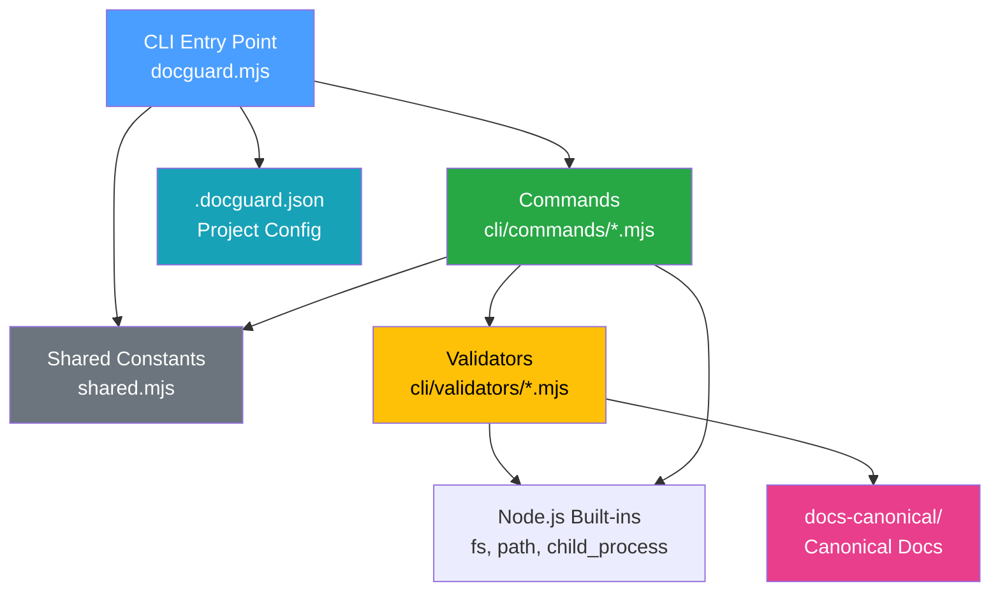

# Architecture

<!-- docguard:version 0.6.0 -->
<!-- docguard:status active -->
<!-- docguard:last-reviewed 2026-07-03 -->

| Metadata | Value |
|----------|-------|
| **Status** |  |
| **Version** | `0.6.0` |
| **Last Updated** | 2026-05-31 |
| **Project Size** | ~24K lines across `cli/` |

---

## System Overview

DocGuard is a near-zero-dependency Node.js CLI tool. It carries one exact-pinned npm runtime dependency, `@babel/parser`, for AST-accurate JS/TS parsing, and uses the developer's own `python3` (no pip/npm dependency) for an AST-accurate Python tier. Both AST tiers load **optionally** with a per-file regex fallback, so the CLI stays robust when a parser is absent — they make JS/TS and Python full-support languages while every other language stays on the regex (beta) tier. It enforces **Canonical-Driven Development (CDD)** — a methodology where documentation is the source of truth. DocGuard audits, scores, and guards project documentation. It generates AI-actionable fix prompts and integrates with CI/CD pipelines.

It targets development teams and AI coding agents that need to maintain documentation quality across projects of any stack (JavaScript, Python, Java, etc.).

## Component Map

| Component | Responsibility | Location | Key Files |
|-----------|---------------|----------|-----------|
| **CLI Entry Point** | Argument parsing, config loading, command routing | `cli/` | `docguard.mjs` |
| **Commands** | User-facing commands (the Daily 5 — init/guard/diff/sync/score — plus situational tools: diagnose, fix, generate, trace, explain, verify, feedback, memory, agent, mcp, upgrade, watch, demo, and `init --with` scaffolders) | `cli/commands/` | `*.mjs` |
| **Validators** | 24 independent validation modules that check specific aspects of CDD compliance — all emitting structured findings with stable codes (the `CODES` registry in `findings.mjs`) | `cli/validators/` | `*.mjs` |
| **Scanners** | 16 project file scanners for test discovery, route detection, schema mapping, CDK/IaC, doc-tools, integrations, frontend surface, spec-kit, memory-plan, semantic claims, agent readability | `cli/scanners/` | `*.mjs` |
| **Writers** | Deterministic doc-mutation and output modules — section-addressable edits, mechanical fix registry, API-Reference writer, generate I/O + doc builders (split from generate.mjs), SARIF emitter (no LLM) | `cli/writers/` | `mechanical.mjs`, `sections.mjs`, `api-reference.mjs`, `generate-io.mjs`, `doc-generators.mjs`, `sarif.mjs` |
| **Config** | Configuration loading — defaults, `.docguard.json` merge, profile presets, project-type detection (extracted from the entry point to keep the import graph acyclic) | `cli/` | `config.mjs` |
| **Shared** | Cross-cutting utilities — ignore/glob filters, source-root resolution, git helpers, and the shared doc→code trace patterns used by both `trace` and the Traceability validator | `cli/` | `shared-ignore.mjs`, `shared-source.mjs`, `shared-git.mjs`, `shared-trace-patterns.mjs`, `shared.mjs` |
| **Templates** | Document skeletons (ARCHITECTURE, SECURITY, etc.) and slash command files for AI agents | `templates/` | `*.template`, `commands/*.md` |
| **Extension** | Spec Kit extension with 5 AI skills, 4 bash scripts, workflow hooks | `extensions/spec-kit-docguard/` | `skills/*/SKILL.md`, `scripts/bash/*.sh` |
| **Tests** | Per-validator unit tests + command-level integration tests using `node:test` | `tests/` | `*.test.mjs` |

## Tech Stack

| Category | Technology | Rationale |
|----------|-----------|-----------|
| Language | JavaScript (ES Modules) | Universal runtime, zero-friction `npx` usage |
| Runtime | Node.js ≥ 18 | Native `node:test`, `node:fs`, `node:child_process` |
| Dependencies | **One npm dep** — `@babel/parser` (exact-pinned, optional-load) | AST-accurate JS/TS parsing; minimal, vetted supply-chain surface |
| Optional external | `python3` (the developer's own) | AST-accurate Python parsing; not an npm/pip dependency, regex fallback when absent |
| Package Manager | npm | Standard for Node.js CLIs |
| Testing | `node:test` + `node:assert` | Built-in, no test framework dependency |
| Docker | `Dockerfile` (MCP server image) | Lets MCP directory inspectors (Glama et al.) boot `docguard mcp` for introspection checks; not part of the npm distribution |

### Recognized Config Files

DocGuard recognizes and validates these project config files:

| File | Purpose |
|------|---------|
| `.docguard.json` | Project-level DocGuard configuration |
| `.docguardignore` | Per-project file exclusions (like `.gitignore`) |
| `vitest.config.ts` / `jest.config.ts` | Test runner config (scanned for custom test patterns) |
| `.storybook/` | Component documentation tool (detected for docs-coverage) |
| `.jules-setup.sh` | This repo's own Google Jules environment bootstrap script (internal tooling, not shipped) |
| `.pre-commit-hooks.yaml` | This repo as a pre-commit hook source — consumers reference `repo: raccioly/docguard` to run `docguard-guard` (changed-only) per commit |
| `glama.json` | Glama MCP directory metadata — declares repo maintainers so the Glama listing can be claimed/managed |
| `server.json` | Official MCP Registry manifest (`io.github.raccioly/docguard`) — server name, npm package, stdio transport |

## Layer Boundaries

The architecture follows a strict 4-layer model where each layer can only import from the layers below it.

| Layer | Contains | Can Import From | Cannot Import From |
|-------|----------|----------------|--------------------|
| **Extension** (`extensions/spec-kit-docguard/`) | AI skills (SKILL.md), bash scripts, hooks, commands | CLI (via npx), Node.js built-ins | Isolated — spec-kit integration layer |
| **Commands** (`cli/commands/`) | User-facing command logic | Validators, Config (via `docguard.mjs` exports) | Isolated — each command is self-contained |
| **Validators** (`cli/validators/`) | Independent validation modules | Scanners, Shared utilities, Node.js built-ins | Cannot import from Commands or Writers |
| **Scanners** (`cli/scanners/`) | Project intelligence — detect routes, schemas, IaC, frontend surface | Shared utilities, Node.js built-ins | Cannot import from Validators, Commands, Writers |
| **Writers** (`cli/writers/`) | Mutate canonical docs surgically (section-addressable, no LLM) | Node.js built-ins only | Cannot import from Validators, Scanners, Commands |
| **Shared** (`cli/shared-*.mjs`) | Cross-cutting utilities: ignore/glob filters, source-root resolution, git helpers, shared trace patterns | Node.js built-ins only | Cannot import from any other layer |
| **Config** (`cli/config.mjs`) | `loadConfig` + defaults/profile merge + project-type detection | Shared utilities, Node.js built-ins | Cannot import from Commands (extracted so `demo`→`docguard` is no longer a cycle) |
| **Entry Point** (`cli/docguard.mjs`) | ANSI colors, argument parsing, command dispatch, banner/help | Commands, Config (`loadConfig`) | Calls validators only through commands |

**Key Rule**: Validators are pure functions. They receive `projectDir` and `config`, then return results. They stay isolated from commands and the CLI entry point. The Extension layer operates independently, using the CLI as an external tool.



## Data Flow

### Request Lifecycle: `docguard guard`

```
User runs: npx docguard guard
     │
     ▼
docguard.mjs
  ├── parseArgs(process.argv)      → flags: { format, dir, ... }
  ├── loadConfig(projectDir)       → .docguard.json → merged with defaults
  │     ├── Reads .docguard.json
  │     ├── Reads package.json (name, type detection)
  │     └── Merges: defaults ← config ← CLI flags
  │
  ▼
guard.mjs
  ├── For each enabled validator:
  │     ├── structure.mjs    → checks docs-canonical/ exists, required files present
  │     ├── docs-sync.mjs    → checks DocGuard metadata headers
  │     ├── drift.mjs        → checks DRIFT-LOG.md for staleness
  │     ├── changelog.mjs    → checks Unreleased section, version entries
  │     ├── architecture.mjs → validates component map, layer boundaries
  │     ├── test-spec.mjs    → checks test framework, coverage docs
  │     ├── security.mjs     → checks auth, secrets documentation
  │     ├── environment.mjs  → checks setup steps, env vars documentation
  │     └── freshness.mjs    → checks git commit dates vs doc last-modified
  │
  ├── Collects: { pass: [...], warn: [...], fail: [...] }
  │
  ▼
Output (text | json)
  └── Exit code: 0 (pass) | 1 (fail) | 2 (warn)
```

### AI Fix Flow: `docguard fix --doc architecture`

```
fix.mjs
  ├── Looks up DOC_EXPECTATIONS['docs-canonical/ARCHITECTURE.md']
  ├── assessDocQuality(content, expectations)
  │     └── Checks: line count, placeholder count, content quality signals
  ├── Outputs: TASK, PURPOSE, RESEARCH STEPS, WRITE THE DOCUMENT
  │
  ▼
AI Agent (Claude Code, Cursor, Copilot, etc.)
  ├── Reads stdout (the research instructions)
  ├── Executes research: reads package.json, scans directories, maps imports
  ├── Writes docs-canonical/ARCHITECTURE.md with real content
  │
  ▼
docguard guard → validates the newly written document
```

## Key Design Decisions

| Decision | Rationale |
|----------|-----------|
| **Minimal dependencies** | One exact-pinned, vetted runtime dep (`@babel/parser`) earns its place by fixing silent regex truncation; it loads optionally so installs stay robust. Everything else is Node.js built-ins. |
| **Config-driven validation** | `.docguard.json` lets projects customize which validators run. A CLI project can skip database docs. |
| **Validators are independent** | Each validator is a self-contained module. Adding a validator keeps existing ones stable. |
| **AI as author, CLI as orchestrator** | The CLI detects problems and generates structured prompts. Documentation writing is the AI's responsibility. |
| **Exit codes for CI** | `0` (pass), `1` (fail), `2` (warn) enables `docguard ci` to gate deployments. |

---

## External Dependencies

DocGuard has **zero runtime dependencies**. All functionality uses Node.js built-in modules.

| Module | Usage |
|--------|-------|
| `node:fs` | File system operations (read docs, check existence) |
| `node:path` | Path resolution and manipulation |
| `node:child_process` | Git operations (freshness checks) |
| `node:url` | ES Module URL resolution |
| `node:readline` | Interactive prompts (init command) |
| `node:test` | Built-in test framework |
| `node:assert` | Test assertions |
| `node:os` | Temp directory for tests |

**Dev dependencies**: None. Tests use `node:test` (built-in since Node.js 18).

---

## Revision History

| Version | Date | Author | Changes |
|---------|------|--------|---------|
| 0.6.0 | 2026-05-31 | DocGuard Team | Refresh for v0.24.0: Python promoted to full support via a `python3` AST tier (`cli/scanners/py-ast.mjs`); JS/TS route extraction extended with cross-file mount-prefix resolution, object-form route declarations, and AST router-screen detection (`cli/scanners/js-ast.mjs`); removed the retired editor extension from the tech stack |
| 0.5.0 | 2026-05-29 | DocGuard Team | Refresh for v0.22–v0.23: validator + scanner set updated, new `config.mjs` (config extracted to break the demo↔docguard cycle) and `shared-trace-patterns.mjs` (shared multilingual trace patterns) |
| 0.4.0 | 2026-03-13 | DocGuard Team | Complete rewrite with real project data, AI orchestration architecture |
| 0.1.0 | 2026-03-13 | DocGuard Generate | Auto-generated skeleton |
