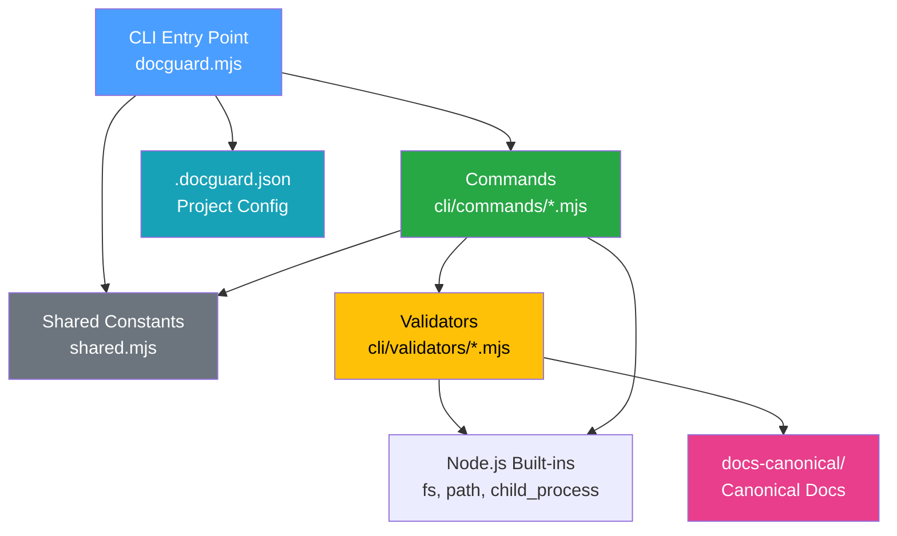

# Architecture

<!-- docguard:version 1.5.0 -->
<!-- docguard:status active -->
<!-- docguard:last-reviewed 2026-09-18 -->

| Metadata | Value |
|----------|-------|
| **Status** |  |
| **Version** | `1.5.0` |
| **Last Updated** | 2026-09-18 |
| **Project Size** | ~39K lines across `cli/` — measured 2026-09-18 with `wc -l` over `cli/**/*.mjs`; re-measure rather than trust this figure |

---

## System Overview

DocGuard is a near-zero-dependency Node.js CLI tool. It carries one exact-pinned npm runtime dependency, `@babel/parser`, for AST-accurate JS/TS parsing, and uses the developer's own `python3` (no pip/npm dependency) for an AST-accurate Python tier. Both parsers load **optionally**. Route and schema scanners retain bounded fallbacks; architecture analysis reports Python import coverage as unsupported when the interpreter is absent rather than fabricating a graph. Other language scanners retain their declared regex (beta) scope. It enforces **Canonical-Driven Development (CDD)** — a methodology where documentation is the source of truth. DocGuard audits, scores, and guards project documentation. It generates AI-actionable fix prompts and integrates with CI/CD pipelines.

It targets development teams and AI coding agents that need to maintain documentation quality across projects of any stack (JavaScript, Python, Java, etc.).

## Component Map

| Component | Responsibility | Location | Key Files |
|-----------|---------------|----------|-----------|
| **CLI Entry Point** | Argument parsing, config loading, command routing | `cli/` | `docguard.mjs` |
| **Commands** | User-facing commands (the Daily 5 — init/guard/diff/sync/score — plus situational tools including reconcile, retire, specs, and `init --with` scaffolders) | `cli/commands/` | `*.mjs` |
| **Document lifecycle** | Finds exact terminal-status docs and completed-task review candidates; explicit retirement removes documentation from active context only after its source revision is reachable from a retained Git ref | `cli/scanners/document-lifecycle.mjs`, `cli/validators/document-lifecycle.mjs`, `cli/commands/retire.mjs` | Scanner is read-only; retirement uses the shared multi-file transaction and remains explicit |
| **Spec lifecycle registry** | Projects immutable spec identities, reviewed lifecycle/lineage/scope, artifact digests, task state, qualified implementation/test evidence, bounded outcomes, and recovery tombstones into one byte-stable control file | `cli/scanners/spec-registry.mjs`, `cli/scanners/requirement-evidence.mjs`, `cli/validators/spec-registry.mjs`, `cli/commands/specs.mjs` | `specs --write` preserves reviewed fields; stale checks identify bounded field paths and distinguish canonical ordering from changed content; only committed, clean, digest-current lifecycle entries can defer traceability, while a current planned entry that is new, removed from the index, or modified pending commit remains advisory; `specs complete` is the only verified-delivery writer |
| **Reconciliation graph** | Inventories changed paths independently from bounded patch text, maps them to direct spec evidence, and keeps mechanical facts, approved intent, decisions, unrelated changes, and unsupported evidence separate | `cli/shared-git.mjs`, `cli/scanners/reconciliation.mjs`, `cli/commands/reconcile.mjs` | Timeout, overflow, parse failure, or incomplete inventory blocks a ready result; planning is read-only and `--write` never rewrites requirements |
| **Precision evidence** | Runs labelled synthetic and exact-commit public cases, separates deterministic results from observations, calculates null-safe quality metrics and confidence bounds, compares case-first baselines, persists them in a provenance envelope whose measure (`benchmark-precision`) and caveat are derived from the cases and re-verified on load, and projects per-code evidence into a generated module the CLI quotes at finding time | `benchmarks/`, `cli/precision-evidence.mjs`, `schemas/docguard-benchmark.schema.json`, `schemas/docguard-benchmark-baseline.schema.json`, `schemas/docguard-precision-evidence.schema.json` | External runs are explicit; third-party project code is never executed and disposable checkouts are removed by default |
| **Feedback fixtures** | Validates synthetic reproductions and opposite controls, reduces them under an explicit predicate, derives duplicate identities, and emits test-only contributions | `cli/feedback-fixture.mjs`, `cli/commands/feedback.mjs`, `schemas/docguard-feedback-fixture.schema.json` | Publication remains user-controlled; contribution generation requires reviewed redaction, scope, and benchmark-delta evidence |
| **Evidence-scoped verification** | Binds one exact Markdown statement to a typed JSON Pointer value, bounded file collection, static Python container literal, or saved upstream compatibility report and returns one of five explicit states | `cli/evidence/`, `cli/validators/evidence.mjs`, `cli/commands/verify.mjs`, `schemas/docguard-evidence.schema.json` | Reads stay local, bounded, non-executable, and symlink/private-path safe; direct verification exits 1 for contradiction/invalid input, 2 for unresolved evidence, and 0 only for verified or unconfigured evidence |
| **Managed Git hooks** | Installs bounded DocGuard blocks while preserving user-owned hook commands before and after them | `cli/commands/hooks.mjs` | Reinstall and removal use one outer marker pair, repair nested markers from affected releases, fail closed on enforcement errors, and fall through after success so user postludes execute |
| **Readiness assessment** | Combines guard enforcement and optional CI score policy without changing structural score semantics | `cli/assessment.mjs`, `cli/commands/ci.mjs`, `cli/commands/diagnose.mjs`, `cli/commands/report.mjs` | READY requires a passing guard and configured gates; ATTENTION carries advisory warnings; BLOCKED identifies failed enforcement |
| **Task-specific agent context** | Ranks exact task paths, qualified requirements, finding codes, identifiers, and bounded lexical overlap across current governed evidence | `cli/scanners/task-context.mjs`, `cli/commands/agent.mjs`, `schemas/docguard-task-context.schema.json` | Read-only and deterministic; excludes retired, unapproved, digest-stale, private, and unsafe material; abstains on weak relevance and never upgrades prose accuracy |
| **Cross-language import graph** | Resolves repository-local JS/TS and Python static imports for cycle and layer checks | `cli/validators/architecture.mjs`, `cli/scanners/py-ast.mjs` | Python supports regular flat/`src/` packages and explicit relatives; dynamic imports, runtime path changes, parse failures, missing interpreters, and ambiguous modules remain explicit limitations |
| **Repository-root guidance** | Detects a likely governing ancestor without changing the selected scan directory | `cli/repository-root.mjs`, `cli/docguard.mjs` | Requires ancestor DocGuard configuration or npm/pnpm membership, respects nested Git boundaries, and uses typed stderr diagnostics for machine modes |
| **Lifecycle transactions and context** | Stages registry, recovery, spec outcome, and current-context changes before any visible mutation and rolls the set back on write or validation failure | `cli/writers/file-transaction.mjs`, `cli/writers/spec-outcomes.mjs`, `cli/scanners/lifecycle-context.mjs` | Active context includes approved current spec pointers and content hashes; retired prose is excluded |
| **Validators** | Independent validation modules that check specific aspects of CDD compliance — all emitting structured findings with stable codes (the `CODES` registry in `findings.mjs`) | `cli/validators/` | `*.mjs` |
| **Scanners** | Project file scanners for test discovery, route detection, schema mapping, CDK/IaC, doc-tools, integrations, frontend surface, spec-kit, memory-plan, semantic claims, agent readability | `cli/scanners/` | `*.mjs` |
| **Writers** | Deterministic doc-mutation and output modules — section-addressable edits, mapped-role ownership authorization, mechanical fix registry, API-Reference writer, generate I/O + doc builders (split from generate.mjs), SARIF emitter (no LLM) | `cli/writers/`, `cli/shared-doc-roles.mjs` | Mapped human docs expose only unique `source=code` sections; new or explicitly generated single-role targets permit whole-document writes; all replacements use backups and `--force` cannot grant ownership |
| **Config** | Configuration loading, schema migration, validator policy, and exact finding-code policy | `cli/` | `config.mjs`, `shared.mjs` |
| **Shared** | Cross-cutting utilities — ignore/glob filters, Git-ignore-aware bounded indexing, package capability counts, source-root resolution, Git helpers, declaration-shaped requirement identity parsing, and the shared doc→code trace patterns used by both `trace` and the Traceability validator | `cli/` | `shared-ignore.mjs`, `shared-validator-surface.mjs`, `shared-source.mjs`, `shared-git.mjs`, `shared-requirements.mjs`, `shared-trace-patterns.mjs`, `shared.mjs` |
| **Templates** | Document skeletons (ARCHITECTURE, SECURITY, etc.) and slash command files for AI agents | `templates/` | `*.template`, `commands/*.md` |
| **Extension** | Spec Kit extension with 5 AI skills, 4 bash scripts, workflow hooks | `extensions/spec-kit-docguard/` | `skills/*/SKILL.md`, `scripts/bash/*.sh` |
| **Tests** | Per-validator unit tests + command-level integration tests using `node:test` | `tests/` | `*.test.mjs` |

## Tech Stack

| Category | Technology | Rationale |
|----------|-----------|-----------|
| Language | JavaScript (ES Modules) | Universal runtime, zero-friction `npx` usage |
| Runtime | Node.js ≥ 18 | Native `node:test`, `node:fs`, `node:child_process` |
| Dependencies | **One npm dep** — `@babel/parser` (exact-pinned, optional-load) | AST-accurate JS/TS parsing; minimal, vetted supply-chain surface |
| Optional external | `python3` (the developer's own) | AST-accurate Python route/schema/import parsing; not an npm/pip dependency; import-graph coverage abstains when absent |
| Package Manager | npm | Standard for Node.js CLIs |
| Testing | `node:test` + `node:assert` | Built-in, no test framework dependency |
| Docker | `Dockerfile` (MCP server image) | Published to GHCR for stdio MCP use; HTTP transport is also available with explicit configuration |

### Recognized Config Files

DocGuard recognizes and validates these project config files:

| File | Purpose |
|------|---------|
| `.docguard.json` | Project-level DocGuard configuration |
| `.docguardignore` | Per-project file exclusions (like `.gitignore`) |
| `vitest.config.ts` / `jest.config.ts` | Test runner config (scanned for custom test patterns) |
| `.storybook/` | Component documentation tool (detected for docs-coverage) |
| `.jules-setup.sh` | This repo's own Google Jules environment bootstrap script (internal tooling, not shipped) |
| `.pre-commit-hooks.yaml` | This repo as a pre-commit hook source — consumers reference `repo: raccioly/docguard` to run `docguard-guard` (changed-only) per commit |
| `glama.json` | Glama MCP directory metadata — declares repo maintainers so the Glama listing can be claimed/managed |
| `server.json` | Official MCP Registry manifest (`io.github.raccioly/docguard`) — server name, npm package, stdio transport |

## Layer Boundaries

The architecture separates command orchestration, validation, extraction, output, configuration, and shared utilities. The boundaries below describe responsibilities and permitted dependencies.

| Layer | Contains | Can Import From | Cannot Import From |
|-------|----------|----------------|--------------------|
| **Extension** (`extensions/spec-kit-docguard/`) | AI skills (SKILL.md), bash scripts, hooks, commands | CLI (via npx), Node.js built-ins | Isolated — spec-kit integration layer |
| **Commands** (`cli/commands/`) | User-facing command logic | Validators, Config (via `docguard.mjs` exports) | Isolated — each command is self-contained |
| **Validators** (`cli/validators/`) | Independent validation modules | Scanners, Shared utilities, Node.js built-ins | Cannot import from Commands or Writers |
| **Evidence** (`cli/evidence/`) | Strict manifest loading, exact Markdown selection, file-only adapters, scoped identities | Safe scanner primitives, Shared utilities, Node.js built-ins | Cannot execute project code, external tools, package managers, or network requests |
| **Scanners** (`cli/scanners/`) | Project intelligence — detect routes, schemas, IaC, frontend surface | Shared utilities, Node.js built-ins | Cannot import from Validators, Commands, Writers |
| **Writers** (`cli/writers/`) | Mutate canonical docs surgically (section-addressable, no LLM) | Shared helpers, Scanners for generated content, Node.js built-ins | Cannot import from Commands or Validators |
| **Shared** (`cli/shared-*.mjs`) | Cross-cutting utilities: ignore/glob filters, source-root resolution, static Worker/Pages binding scopes, git helpers, shared trace patterns | Node.js built-ins plus optional direct parser loading where documented | Cannot import from Validators, Commands, or Writers |
| **Config** (`cli/config.mjs`) | `loadConfig` + defaults/profile merge + project-type detection | Shared utilities, Node.js built-ins | Cannot import from Commands (extracted so `demo`→`docguard` is no longer a cycle) |
| **Entry Point** (`cli/docguard.mjs`) | ANSI colors, argument parsing, command dispatch, banner/help | Commands, Config (`loadConfig`) | Calls validators only through commands |

### Key rule

**Key Rule**: Validators are pure functions. They receive `projectDir` and `config`, then return results. They stay isolated from commands and the CLI entry point. The Extension layer operates independently, using the CLI as an external tool.

### Layer graph


```mermaid
graph TD
    A["CLI Entry Point<br/>docguard.mjs"] --> B["Shared Constants<br/>shared.mjs"]
    A --> C["Commands<br/>cli/commands/*.mjs"]
    C --> B
    C --> D["Validators<br/>cli/validators/*.mjs"]
    D --> E["Node.js Built-ins<br/>fs, path, child_process"]
    C --> E
    A --> F[".docguard.json<br/>Project Config"]
    D --> G["docs-canonical/<br/>Canonical Docs"]

    style A fill:#4a9eff,color:#fff
    style B fill:#6c757d,color:#fff
    style C fill:#28a745,color:#fff
    style D fill:#ffc107,color:#000
    style F fill:#17a2b8,color:#fff
    style G fill:#e83e8c,color:#fff
```

## Data Flow

### Request Lifecycle: `docguard guard`

```
User runs: npx docguard guard
     │
     ▼
docguard.mjs
  ├── parseArgs(process.argv)      → flags: { format, dir, ... }
  ├── loadConfig(projectDir)       → .docguard.json → merged with defaults
  │     ├── Reads .docguard.json
  │     ├── Reads package.json (name, type detection)
  │     └── Merges: defaults ← config ← CLI flags
  │
  ▼
guard.mjs
  ├── For each enabled validator:
  │     ├── structure.mjs    → checks docs-canonical/ exists, required files present
  │     ├── docs-sync.mjs    → checks DocGuard metadata headers
  │     ├── drift.mjs        → checks DRIFT-LOG.md for staleness
  │     ├── changelog.mjs    → checks Unreleased section, version entries
  │     ├── architecture.mjs → validates component map, layer boundaries
  │     ├── test-spec.mjs    → checks test framework, coverage docs
  │     ├── security.mjs     → checks auth, secrets documentation
  │     ├── environment.mjs  → checks setup steps, env vars documentation
  │     └── freshness.mjs    → checks git commit dates vs doc last-modified
  │
  ├── Collects: { pass: [...], warn: [...], fail: [...] }
  │
  ▼
Output (text | json)
  └── Exit code: 0 (pass) | 1 (fail) | 2 (warn) | 3 (errors, but project not initialised)
```

### AI Fix Flow: `docguard fix --doc architecture`

```
fix.mjs
  ├── Looks up DOC_EXPECTATIONS['docs-canonical/ARCHITECTURE.md']
  ├── assessDocQuality(content, expectations)
  │     └── Checks: line count, placeholder count, content quality signals
  ├── Outputs: TASK, PURPOSE, RESEARCH STEPS, WRITE THE DOCUMENT
  │
  ▼
AI Agent (Claude Code, Cursor, Copilot, etc.)
  ├── Reads stdout (the research instructions)
  ├── Executes research: reads package.json, scans directories, maps imports
  ├── Writes docs-canonical/ARCHITECTURE.md with real content
  │
  ▼
docguard guard → validates the newly written document
```

## Key Design Decisions

| Decision | Rationale |
|----------|-----------|
| **Minimal dependencies** | One exact-pinned, vetted runtime dep (`@babel/parser`) earns its place by fixing silent regex truncation; it loads optionally so installs stay robust. Everything else is Node.js built-ins. |
| **Config-driven validation** | `.docguard.json` lets projects customize which validators run. A CLI project can skip database docs. |
| **Validators are independent** | Each validator is a self-contained module. Adding a validator keeps existing ones stable. |
| **AI as author, CLI as orchestrator** | The CLI detects problems and generates structured prompts. Documentation writing is the AI's responsibility. |
| **Exit codes for CI** | `0` (pass), `1` (fail), `2` (warn), `3` (errors in a project with no `.docguard.json`) enables `docguard ci` to gate deployments. `3` stays non-zero so an any-non-zero gate is unchanged, but it lets the generated Git hook distinguish "never adopted DocGuard" from "failed its checks". |
| **Scoped factual evidence** | `.docguard-evidence.json` declares narrow, typed source-to-statement predicates. Contradictions fail guard; stale, inconclusive, and unsupported evidence stays visible. A verified statement never exempts its document from freshness or semantic review. |
| **Evidence before context volume** | `agent --task` returns a bounded retrieval packet only after the frozen evaluation showed equal hidden-test safety and lower steps/latency. It remains opt-in because uncached token use increased and the synthetic protocol does not establish universal benefit. |

---

## External Dependencies

DocGuard declares one exact-pinned runtime dependency, `@babel/parser`. It loads optionally: installations without Babel use a less precise regex fallback. The modules below supply the remaining runtime functionality.

| Module | Usage |
|--------|-------|
| `node:fs` | File system operations (read docs, check existence) |
| `node:path` | Path resolution and manipulation |
| `node:child_process` | Git operations (freshness checks) |
| `node:url` | ES Module URL resolution |
| `node:readline` | Interactive prompts (init command) |
| `node:test` | Built-in test framework |
| `node:assert` | Test assertions |
| `node:os` | Temp directory for tests |

**Dev dependencies**: None. Tests use `node:test` (built-in since Node.js 18).

---

## Revision History

| Version | Date | Author | Changes |
|---------|------|--------|---------|
| 1.5.0 | 2026-09-18 | DocGuard Team | Freshness review: corrected a project-size figure stale since 2026-05-29 and recorded guard exit code 3 for uninitialised projects |
| 1.4.0 | 2026-09-15 | DocGuard Team | Bound package capability claims to shipped modules, pruned ignored and nested checkout copies from instruction pointers, and made non-clean planned lifecycle state advisory only |
| 1.3.0 | 2026-09-15 | DocGuard Team | Made managed hooks composable and self-repairing, aligned direct evidence exit codes with guard severity, and exposed field-level registry drift |
| 1.2.0 | 2026-09-15 | DocGuard Team | Made router mounts symbol-aware and statically composable, retained negative scan evidence as review-only, and aligned monorepo/config/design-sync discovery boundaries |
| 1.1.0 | 2026-09-15 | DocGuard Team | Added packed adoption qualification, independent diff inventory, exact finding-code policy, combined readiness assessment, lifecycle-aware traceability, static Python literal evidence, and transitive static router-mount resolution with test-client exclusion |
| 1.0.0 | 2026-09-14 | DocGuard Team | Added deterministic task-specific context selection, lifecycle and safe-reader boundaries, strict packet schema, and the frozen promotion benchmark |
| 0.9.0 | 2026-09-14 | DocGuard Team | Added strict evidence manifests, typed local adapters, five-state evaluation, exact semantic-claim coverage, and guard/agent assurance integration |
| 0.8.0 | 2026-09-14 | DocGuard Team | Added transactional retirement/completion writes, reconciliation review graphs, qualified implementation evidence, bounded outcomes, active-context regeneration, and Spec Kit completion hooks |
| 0.7.0 | 2026-09-14 | DocGuard Team | Added the deterministic spec lifecycle registry, immutable spec-ID resolution, shared requirement evidence scanner, recovery tombstones, and two-stage preflight boundary |
| 0.6.0 | 2026-05-31 | DocGuard Team | Refresh for v0.24.0: Python promoted to full support via a `python3` AST tier (`cli/scanners/py-ast.mjs`); JS/TS route extraction extended with cross-file mount-prefix resolution, object-form route declarations, and AST router-screen detection (`cli/scanners/js-ast.mjs`); removed the retired editor extension from the tech stack |
| 0.5.0 | 2026-05-29 | DocGuard Team | Refresh for v0.22–v0.23: validator + scanner set updated, new `config.mjs` (config extracted to break the demo↔docguard cycle) and `shared-trace-patterns.mjs` (shared multilingual trace patterns) |
| 0.4.0 | 2026-03-13 | DocGuard Team | Complete rewrite with real project data, AI orchestration architecture |
| 0.1.0 | 2026-03-13 | DocGuard Generate | Auto-generated skeleton |


### Requirement identity across documents

Requirement definitions are identified by immutable spec ID plus requirement ID when a spec declares `Spec ID` metadata. Repository-relative path qualifiers remain supported during migration. A bare test annotation such as `@req FR-001` earns linkage credit only when that ID is defined in one active or retired document. Prefer `@req acme.payments#FR-001`; `@req specs/payments/spec.md#FR-001` remains valid while the spec is active. Path qualifiers use forward slashes and are repository-relative.

Validation, `trace --features`, and the spec registry share definition parsing and reference resolution. A qualified reference credits only its target document. Ambiguous bare references credit neither feature and produce a review finding for each unresolved definition. A wrong qualifier is an orphan reference and never falls back to a bare match. Registry completion evidence always requires an explicit spec ID or exact path qualifier, even when a bare ID is currently unique. Repeated mentions within one document do not create additional identities. Linkage remains evidence of a declaration, not proof of behavioral correctness.

Completion also supports reviewed maintenance of a verified or released living spec. It reconciles from the prior reviewed revision and appends a status-preserving outcome when a linked source, test, canonical document, or decision changed. Eligibility comes exclusively from those reviewable changes; generated registry, active-context, and implementation-outcome updates are excluded.
